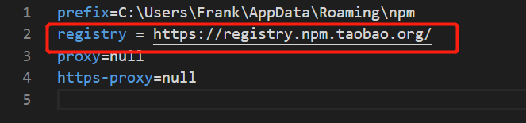
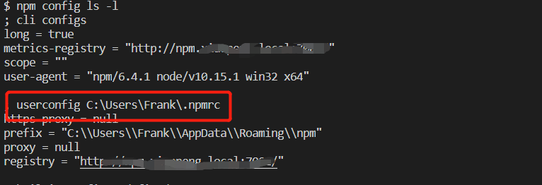

## npm install报错，会出现如下提示：
### 
## 解决方法：重新设置npm代理
### 1、依次输入以下命令
- 1、npm config set proxy null
- 2、npm config set https-proxy null
- 3、npm --registry https://registry.npm.taobao.org info underscore
### 2、在.npmrc文件中替换代理：registry = https://registry.npm.taobao.org/
### 
- 备注：.npmrc文件的位置可以使用npm config ls -l命令查看
### 
### 3、再次npm install就可以了
